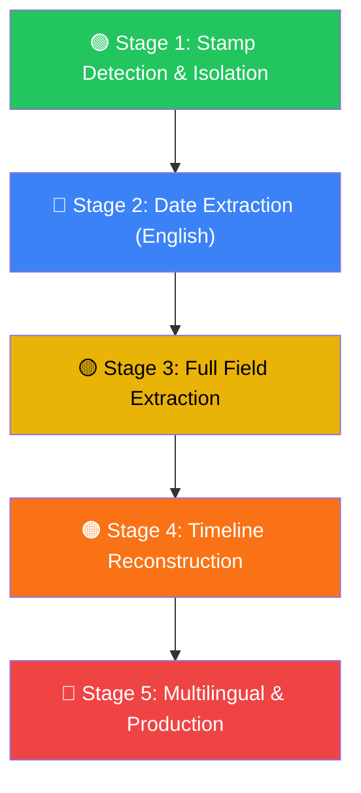
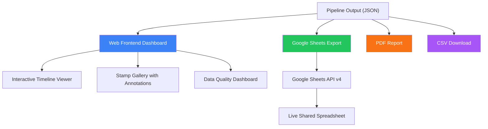

# Travel History Reconstruction from Travel Documents

## Capstone Project Proposal & Technical Report

---

**University of California, Los Angeles — Master of Science in Engineering**
**Sponsor:** Securiport (Alvaro, Sponsor Contact)
**Date:** June 2, 2026

| Team Member | Role | Primary Responsibility |
|---|---|---|
| **Hao Zhang** | Team Coordinator | ML Pipeline, Stamp Detection, Project Management |
| **Zuyan Tao** | Agentic Backend | OCR/VLM Integration, API, System Orchestration |
| **Wilson Tee** | Data & Frontend | Data Engineering, Evaluation, UI/Visualization |

---

## 1. Executive Summary

Securiport provides civil aviation security, border management, and immigration control systems to governments worldwide. A core operational need is converting **unstructured passport page scans** — containing overlapping ink stamps, faded text, and multilingual content — into **structured, chronological travel histories**.

This project builds an end-to-end software system that:

1. Accepts scanned passport page images as input
2. Detects and isolates individual stamps/visa markings
3. Extracts dates, country identifiers, and arrival/departure indicators
4. Reconstructs a validated, chronological travel timeline
5. Produces a structured report with traceability metadata

Following sponsor guidance, the project is organized into **hierarchical stages** — each stage is a self-contained, demonstrable milestone. Reaching any stage constitutes a defensible, complete project outcome.

---

## 2. Problem Statement

### 2.1 Context

Passport pages accumulate stamps from border crossings. These stamps vary enormously:
- **Shape:** Circular, rectangular, triangular, irregular
- **Language:** English, Arabic, Chinese, Cyrillic, etc.
- **Quality:** Faded ink, partial impressions, overlapping stamps
- **Content:** Dates in different formats, country codes, entry/exit indicators

Currently, reconstructing a travel history from these documents requires **manual inspection by trained analysts** — a slow, error-prone, and unscalable process.

### 2.2 Objectives

| # | Objective | Success Criteria |
|---|---|---|
| O1 | Detect stamp regions in passport scans | mAP ≥ 0.70 on test set |
| O2 | Extract dates from detected stamps | Accuracy ≥ 80% on English stamps |
| O3 | Identify country and entry/exit type | Accuracy ≥ 70% on English stamps |
| O4 | Produce chronological travel timeline | Valid ordering on ≥ 75% of test subjects |
| O5 | Support multilingual stamp text | Functional on ≥ 3 languages |

### 2.3 Language Strategy: English-First, Then Multilingual Expansion

Passport stamps worldwide use dozens of languages and scripts. Rather than attempting universal multilingual support from day one — which would demand far more training data, model complexity, and validation effort — we adopt a deliberate **English-first strategy** with a planned expansion path:


**Phase 1 — English Only (Stages 1–4)**
- All OCR models, regex parsers, and date/country extractors target English text
- English covers the majority of international border stamps (ICAO standards recommend English annotations)
- This lets us build and validate the full pipeline end-to-end before introducing language complexity
- PaddleOCR's pretrained English model is used out-of-the-box — no fine-tuning required

**Phase 2 — Latin-Script Languages (Stage 5a)**
- Expand to French, Spanish, Portuguese, German — languages that share the Latin alphabet
- PaddleOCR supports these with a simple `lang` parameter switch
- Date formats and country name dictionaries are extended per language
- VLM fallback (MiniCPM-o) handles mixed-language stamps without separate model training

**Phase 3 — Non-Latin Scripts (Stage 5b, Stretch)**
- Arabic, Chinese, Cyrillic, Thai, etc.
- Requires dedicated PaddleOCR script-specific models or VLM-only extraction
- Each script is added as a pluggable module — the pipeline architecture supports this via the `lang` config parameter

**Rationale:** This staged language approach directly mirrors Alvaro's guidance: *"Start with English and discard any other language. Then, if time allows, you can go deeper with those more types of characters."* By treating multilingual support as an additive expansion rather than a prerequisite, we ensure the core pipeline is robust and demonstrable at every stage.

---

## 3. Staged Milestone Architecture

> *"Think about this project in something that has stages. Each stage is like a goal. If you reach it, you can defend your project with that."* — Alvaro, Securiport



### Stage 1 — Stamp Detection & Isolation *(Minimum Viable Deliverable)*

**Goal:** Given a passport page image, detect all stamp regions and output cropped stamp images.

| Component | Implementation |
|---|---|
| Preprocessing | OpenCV: deskew, CLAHE contrast enhancement, denoising |
| Detection Model | YOLOv8s fine-tuned on stamp dataset |
| Output | Bounding boxes + cropped stamp images with confidence scores |

**Datasets:**
- Roboflow Universe: "Stamp Detection" datasets (YOLO format)
- Kaggle: passport/document stamp datasets
- Self-collected: team members' passport scans (anonymized)

**Deliverable:** CLI tool that takes a passport image → outputs numbered crop images of each detected stamp.

### Stage 2 — Date Extraction from Stamps

**Goal:** Extract date strings from each isolated stamp image (English text only).

| Component | Implementation |
|---|---|
| OCR Engine | PaddleOCR (English) |
| Date Parser | `python-dateutil` + custom regex patterns |
| Validation | Cross-check parsed dates against plausible travel date ranges |

**Supported date formats:** `DD MMM YYYY`, `DD/MM/YYYY`, `YYYY-MM-DD`, `MM/DD/YYYY`

**Deliverable:** Each stamp crop → extracted date(s) with confidence score.

### Stage 3 — Full Field Extraction

**Goal:** Beyond dates, extract country name/code and arrival/departure indicator.

| Component | Implementation |
|---|---|
| VLM Integration | MiniCPM-o or Qwen-VL for structured extraction |
| Field Schema | `{date, country, direction, confidence, raw_text}` |
| Classification | Entry vs. Exit based on textual cues + stamp shape/color heuristics |

**Deliverable:** Each stamp → structured JSON record with all extracted fields.

### Stage 4 — Timeline Reconstruction & Report

**Goal:** Aggregate per-stamp records into a coherent travel history for a subject.

| Component | Implementation |
|---|---|
| Ordering | Chronological sort with conflict detection |
| Validation | Entry-exit pairing, geographic plausibility checks |
| Output | JSON timeline + PDF/HTML analytical report |
| Traceability | Each record linked to source image, crop region, extraction timestamp |

**Deliverable:** Full pipeline: passport pages → structured travel history report.

### Stage 5 — Multilingual & Production Hardening *(Stretch Goal)*

**Goal:** Support non-English stamps and production-grade deployment.

| Component | Implementation |
|---|---|
| Multilingual OCR | PaddleOCR multilingual models + VLM fallback |
| Languages | Arabic, French, Spanish, Chinese (prioritized by data availability) |
| API | FastAPI service with authentication |
| Monitoring | Logging, error tracking, confidence dashboards |

---

## 4. System Architecture

### 4.1 High-Level Pipeline

```
┌─────────────┐     ┌──────────────┐     ┌─────────────┐     ┌───────────────┐     ┌────────────┐
│ Input Image │────▶│ Preprocessing│────▶│  Detection   │────▶│  Extraction   │────▶│ Reconstruct│
│ (Passport)  │     │ Enhancement  │     │  YOLOv8      │     │  OCR / VLM    │     │ Timeline   │
└─────────────┘     └──────────────┘     └─────────────┘     └───────────────┘     └────────────┘
                          │                     │                     │                    │
                     Deskew, CLAHE         Bounding boxes       Structured fields     Chronological
                     Denoise               + Crop images        per stamp             travel history
```

### 4.2 Technology Stack

| Layer | Technology | Justification |
|---|---|---|
| **Language** | Python 3.11+ | ML ecosystem, team expertise |
| **Detection** | YOLOv8 (Ultralytics) | SOTA speed/accuracy, easy fine-tuning |
| **OCR** | PaddleOCR | Best open-source multilingual OCR |
| **VLM** | MiniCPM-o / Qwen-VL | Multimodal understanding without cloud APIs |
| **Image Processing** | OpenCV, scikit-image | Industry standard |
| **API** | FastAPI + Uvicorn | Async, auto-docs, production-ready |
| **Experiment Tracking** | Weights & Biases | Free for academics, excellent visualization |
| **Config** | YAML + Pydantic | Type-safe, human-readable |
| **Testing** | pytest | Standard Python testing |
| **Version Control** | Git + GitHub | Collaboration, CI/CD |

### 4.3 Module Design

```
src/
├── preprocessing/
│   ├── enhancer.py          # CLAHE, denoising, deskew
│   └── normalizer.py        # Resize, DPI normalization
├── detection/
│   ├── stamp_detector.py    # YOLOv8 inference wrapper
│   ├── trainer.py           # Fine-tuning script
│   └── postprocess.py       # NMS, crop extraction
├── ocr/
│   ├── paddle_engine.py     # PaddleOCR wrapper
│   ├── vlm_engine.py        # VLM-based extraction
│   └── field_parser.py      # Date/country/direction parsing
├── reconstruction/
│   ├── timeline_builder.py  # Chronological assembly
│   ├── validator.py         # Entry-exit pairing, plausibility
│   └── reporter.py          # JSON/PDF/HTML output
├── api/
│   ├── main.py              # FastAPI app + CLI entry
│   ├── routes.py            # API endpoints
│   └── schemas.py           # Pydantic request/response models
└── utils/
    ├── config.py            # YAML config loader
    ├── logger.py            # Loguru setup
    └── io.py                # Image I/O helpers
```

---

## 5. Data Strategy

### 5.1 Data Sources

| Source | Type | Volume | Notes |
|---|---|---|---|
| Roboflow Universe | Stamp detection annotations | ~500-2000 images | YOLO format, ready to use |
| Kaggle | Passport/document datasets | Variable | May need re-annotation |
| Team-collected | Real passport scans | ~50-100 pages | Primary test/validation set |
| Synthetic | Generated stamp overlays | Unlimited | Data augmentation |

### 5.2 Annotation Strategy

- **Tool:** Roboflow (web-based, free tier) or LabelImg (local)
- **Format:** YOLO `.txt` (class x_center y_center width height)
- **Classes (Stage 1):** `stamp`
- **Classes (Stage 3+):** `entry_stamp`, `exit_stamp`, `visa_sticker`

### 5.3 Data Augmentation

To compensate for limited real data:
- Random rotation (±15°), perspective transforms
- Color jitter (simulate ink fading, different ink colors)
- Gaussian blur (simulate camera defocus)
- Synthetic stamp overlay on clean passport backgrounds
- Mosaic augmentation (built into YOLOv8)

---

## 6. Model Selection & Fine-Tuning

### 6.1 Stamp Detection — YOLOv8

**Base model:** `yolov8s.pt` (small variant — good accuracy/speed tradeoff for limited compute)

**Fine-tuning plan:**
```python
from ultralytics import YOLO

model = YOLO("yolov8s.pt")  # Load pretrained COCO weights
results = model.train(
    data="configs/stamp_dataset.yaml",
    epochs=100,
    imgsz=640,
    batch=16,
    patience=20,          # Early stopping
    augment=True,
    project="runs/detect",
    name="stamp_v1"
)
```

**Compute:** Single GPU (NVIDIA RTX 3060+ or Colab Pro) — training ~2-4 hours.

### 6.2 OCR — PaddleOCR

No fine-tuning needed initially. Use pretrained English model:
```python
from paddleocr import PaddleOCR
ocr = PaddleOCR(use_angle_cls=True, lang='en', use_gpu=True)
result = ocr.ocr(stamp_crop_image)
```

### 6.3 VLM — Structured Extraction (Stage 3)

Use a vision-language model for complex stamps where rule-based parsing fails:
```python
# Prompt template for VLM
EXTRACTION_PROMPT = """
Analyze this passport stamp image and extract:
1. Date (in ISO 8601 format YYYY-MM-DD)
2. Country name or code
3. Direction: ENTRY or EXIT
4. Any other visible text

Return as JSON: {"date": "...", "country": "...", "direction": "...", "raw_text": "..."}
If a field is unreadable, set it to null.
"""
```

**Model options (ranked by compute requirement):**
1. **MiniCPM-o 2.6** (~8B params) — Best quality/size ratio, runs on single GPU
2. **InternVL2** — Strong multilingual capability
3. **Qwen-VL** — Good for CJK text

---

## 7. Output Specification & Frontend Integration

### 7.1 Per-Stamp Record

```json
{
  "stamp_id": "STAMP_001",
  "source_image": "passport_page_03.jpg",
  "bounding_box": [120, 340, 280, 180],
  "crop_path": "crops/stamp_001.jpg",
  "detection_confidence": 0.92,
  "extracted_fields": {
    "date": "2024-03-15",
    "country": "GBR",
    "direction": "ENTRY",
    "raw_text": "HEATHROW  15 MAR 2024  LEAVE TO ENTER",
    "extraction_confidence": 0.85
  },
  "extraction_timestamp": "2026-06-15T10:30:00Z",
  "passenger_id": "SUBJECT_A"
}
```

### 7.2 Travel Timeline

```json
{
  "passenger_id": "SUBJECT_A",
  "total_stamps_detected": 12,
  "total_stamps_parsed": 10,
  "unreadable_stamps": 2,
  "timeline": [
    {"date": "2024-01-10", "country": "USA", "direction": "EXIT", "confidence": 0.91},
    {"date": "2024-01-11", "country": "GBR", "direction": "ENTRY", "confidence": 0.88},
    {"date": "2024-02-20", "country": "GBR", "direction": "EXIT", "confidence": 0.79},
    {"date": "2024-02-20", "country": "FRA", "direction": "ENTRY", "confidence": 0.83}
  ],
  "data_quality": {
    "high_confidence_records": 8,
    "low_confidence_records": 2,
    "flagged_conflicts": 1,
    "notes": ["Stamps 7 and 8 have overlapping ink — dates may be inaccurate"]
  }
}
```

### 7.3 Frontend Visualization & Export Design

The reconstructed travel history should be **immediately actionable** — not buried in JSON files. We design a multi-channel output layer that presents results intuitively and integrates with external tools analysts already use.



**A. Web Frontend Dashboard (FastAPI + HTML/JS)**

A lightweight web UI served by the FastAPI backend:

| View | Description |
|---|---|
| **Upload** | Drag-and-drop passport page images; batch upload supported |
| **Timeline Viewer** | Interactive chronological timeline (vis-timeline.js or similar); click any entry to see the source stamp crop |
| **Stamp Gallery** | Grid of detected stamp crops with extracted fields overlaid; color-coded by confidence (green/yellow/red) |
| **Data Quality Panel** | Summary stats: total stamps, parse rate, flagged conflicts, unreadable items |
| **Export Controls** | One-click export to Google Sheets, CSV, or PDF |

**B. Google Sheets Integration**

Analysts and sponsors often work in spreadsheets. We provide **direct push to Google Sheets** via the Google Sheets API v4:

```python
# Export flow using gspread (Python Google Sheets client)
import gspread
from google.oauth2.service_account import Credentials

def export_to_google_sheets(timeline_data: dict, spreadsheet_name: str):
    """Push travel timeline to a Google Sheets spreadsheet."""
    creds = Credentials.from_service_account_file(
        "configs/google_credentials.json",
        scopes=["https://www.googleapis.com/auth/spreadsheets"]
    )
    gc = gspread.authorize(creds)

    # Create or open spreadsheet
    try:
        sheet = gc.open(spreadsheet_name).sheet1
    except gspread.SpreadsheetNotFound:
        sheet = gc.create(spreadsheet_name).sheet1

    # Write headers
    headers = ["#", "Date", "Country", "Direction", "Confidence", "Raw Text", "Source Image", "Stamp ID"]
    sheet.update('A1:H1', [headers])

    # Write timeline rows
    rows = []
    for i, entry in enumerate(timeline_data["timeline"], 1):
        rows.append([
            i, entry["date"], entry["country"], entry["direction"],
            f"{entry['confidence']:.0%}", entry.get("raw_text", ""),
            entry.get("source_image", ""), entry.get("stamp_id", "")
        ])
    sheet.update(f'A2:H{len(rows)+1}', rows)

    return sheet.url
```

**Google Sheets export features:**
- Auto-creates a new spreadsheet per subject or appends to an existing one
- Shareable link generated automatically — team and sponsor can view/edit in real time
- Conditional formatting applied via API: red for low-confidence, green for high-confidence rows
- Companion "Summary" tab with aggregate statistics and data quality notes

**C. Additional Export Formats**

| Format | Use Case | Library |
|---|---|---|
| **CSV** | Bulk data processing, import to other tools | Built-in `csv` module |
| **PDF** | Formal reports for sponsor delivery | `reportlab` or `weasyprint` |
| **JSON** | Programmatic consumption, API responses | Native Python |
| **Excel (.xlsx)** | Offline spreadsheet work | `openpyxl` |

---

## 8. Team Responsibilities & Work Breakdown

### 8.1 Role Assignments

| 🟢 Hao Zhang — Coordinator & ML Lead | 🔵 Zuyan Tao — Agentic Backend | 🟠 Wilson Tee — Data & Frontend |
|---|---|---|
| Project planning & sponsor communication | OCR / VLM integration | Data collection & annotation |
| Stamp detection model training | Pipeline orchestration | Dataset curation & augmentation |
| Data preprocessing pipeline | FastAPI backend | Visualization dashboard |
| Evaluation metrics & benchmarking | Agentic workflows & error handling | Testing & documentation |

### 8.2 Cross-Cutting Responsibilities

- **Code reviews:** All PRs require ≥ 1 approval
- **Weekly standup:** 30-min sync (suggested: Monday)
- **Sponsor check-in:** Bi-weekly with Alvaro
- **Documentation:** Each member documents their modules

---

## 9. Project Timeline

> **Assumption:** 10-week quarter timeline. Adjust dates to your actual quarter schedule.

| Week | Stage | Deliverables | Owner |
|---|---|---|---|
| **1-2** | Setup & Data | Repo setup, data collection, initial annotations, environment config | All |
| **3-4** | Stage 1 | YOLOv8 fine-tuning, stamp detection baseline, evaluation | Hao |
| | | Preprocessing pipeline, augmentation | Hao |
| | | Data collection, annotation, dataset curation | Wilson |
| | | OCR engine integration (PaddleOCR) | Zuyan |
| **5** | Stage 2 | Date extraction pipeline, regex + dateutil parsing | Zuyan |
| | | Detection model iteration, mAP optimization | Hao |
| **6-7** | Stage 3 | VLM integration for full field extraction | Zuyan |
| | | Country code database, direction classification | Hao |
| | | Evaluation framework, test suite | Wilson |
| **8** | Stage 4 | Timeline reconstruction logic, conflict resolution | Zuyan + Hao |
| | | Report generation (JSON/PDF) | Wilson |
| **9** | Stage 5 | Multilingual OCR (stretch), API endpoints | All |
| **10** | Polish | Final report, demo preparation, sponsor presentation | All |

### Key Milestones

| Milestone | Target | Gate Criteria |
|---|---|---|
| **M1: Detection works** | Week 4 | ≥ 70% mAP on test set |
| **M2: Dates extracted** | Week 5 | ≥ 80% date accuracy (English) |
| **M3: Full extraction** | Week 7 | Country + direction extracted |
| **M4: Timeline complete** | Week 8 | End-to-end pipeline functional |
| **M5: Demo-ready** | Week 10 | Sponsor presentation delivered |

---

## 10. Risk Assessment & Mitigation

| Risk | Likelihood | Impact | Mitigation |
|---|---|---|---|
| Insufficient training data | High | High | Synthetic augmentation, Roboflow public datasets, cross-domain transfer |
| Low stamp detection accuracy | Medium | High | Ensemble models, lower confidence threshold with human review flag |
| Overlapping stamps confuse OCR | High | Medium | Per-stamp cropping isolates text; VLM handles context better than pure OCR |
| Multilingual text too complex | Medium | Low | Scoped as stretch goal (Stage 5); English-first approach |
| Limited GPU compute | Medium | Medium | Use YOLOv8s (small), Google Colab Pro, quantized VLM inference |
| Date format ambiguity (MM/DD vs DD/MM) | High | Medium | Geographic context + confidence scoring; flag ambiguous cases |
| Scope creep | Medium | Medium | Staged architecture ensures any stage is a complete deliverable |

---

## 11. Evaluation Plan

### 11.1 Detection Metrics

- **mAP@0.5** — Primary detection metric
- **mAP@0.5:0.95** — Stricter localization quality
- **Precision / Recall** — Per-class performance
- **Inference time** — Frames per second

### 11.2 Extraction Metrics

- **Date accuracy** — Exact match of extracted vs. ground truth date
- **Country accuracy** — Correct ISO-3166 code
- **Direction accuracy** — Correct ENTRY/EXIT classification
- **Field-level F1** — Per-field precision/recall

### 11.3 End-to-End Metrics

- **Timeline correctness** — Percentage of correctly ordered records
- **Entry-exit pairing accuracy** — Correct matching of entry/exit pairs
- **Processing time** — Seconds per passport page

### 11.4 Test Set Construction

- **Hold-out set:** 20% of annotated data, never used in training
- **Cross-validation:** 5-fold for detection model during development
- **Blind test:** Team members' real passport scans (final evaluation only)

---

## 12. Tools & Infrastructure

| Category | Tool | Purpose |
|---|---|---|
| Version Control | GitHub (private repo) | Code, configs, docs |
| Large Files | Git LFS or DVC | Model weights, datasets |
| CI/CD | GitHub Actions | Linting, tests on PR |
| Experiment Tracking | Weights & Biases | Training curves, model comparison |
| Annotation | Roboflow / LabelImg | Bounding box labeling |
| **Collaboration & Docs** | **Notion (free team plan)** | **Proposal co-editing, meeting notes, task board** |
| Communication | Slack / WeChat | Daily coordination |
| Compute | Local GPU + Colab Pro | Training and inference |
| Frontend Export | Google Sheets API + gspread | Live spreadsheet output |

### 12.1 Recommended Collaboration Tool: Notion

For co-editing the proposal, tracking tasks, and sharing meeting notes, we recommend **Notion** (free for teams up to 10 members with the Education plan):

| Feature | Why It Fits |
|---|---|
| **Real-time co-editing** | All 3 members can edit the proposal simultaneously — similar to Google Docs |
| **Markdown native** | Our proposal is written in Markdown; Notion renders and edits it natively |
| **Task boards (Kanban)** | Built-in project board to track stage milestones, assign tasks, set due dates |
| **Wiki/knowledge base** | Centralize research notes, model experiment logs, and meeting minutes |
| **Free for education** | Free with a `.edu` email; no credit card required |
| **Integrations** | Connects to GitHub (link PRs), Google Drive, and Slack |

**Alternatives considered:**
- **Google Docs** — Excellent for co-editing, but poor for Markdown and has no task management
- **HackMD / CodiMD** — Good Markdown co-editing, but lacks task boards
- **GitHub Wiki** — Integrated with repo, but editing UX is poor for non-technical writing

> **Setup:** One team member creates a Notion workspace → invites the other two via UCLA email → import this proposal as a Notion page → use the built-in Kanban board for sprint tracking.

---

## 13. Ethical & Privacy Considerations

- All passport images used for development will be **anonymized** (biographical pages excluded, MRZ zones redacted)
- No real personal data will be stored in the repository
- The system processes only stamp regions — it does not extract or store biometric data
- Model weights and datasets will be stored in a **private repository**
- Final deliverables to Securiport will follow their data handling guidelines

---

## 14. Conclusion

This project delivers a **practical, staged system** for reconstructing travel histories from passport scans. The hierarchical milestone design — endorsed by sponsor Alvaro — ensures that every stage reached is a **complete, demonstrable, and defensible** outcome.

The technical approach leverages state-of-the-art pretrained models (YOLOv8, PaddleOCR, VLMs) that can be fine-tuned with limited data and compute, while the modular software architecture enables independent development and testing of each pipeline component.

The team is well-positioned to deliver at minimum through **Stage 3** (full field extraction) and aims to complete through **Stage 4** (timeline reconstruction) with **Stage 5** (multilingual support) as a stretch goal.

---

## Appendix A: References

1. Ultralytics YOLOv8 — https://github.com/ultralytics/ultralytics
2. PaddleOCR — https://github.com/PaddlePaddle/PaddleOCR
3. MiniCPM-o — https://github.com/OpenBMB/MiniCPM-o
4. Roboflow Universe (Stamp Detection) — https://universe.roboflow.com
5. Securiport — https://www.securiport.com
6. Ooredoo Stamp Detection Model — https://huggingface.co/Ooredoo-Group/ooredoo-stamp-detection

## Appendix B: Repository Structure

```
travel-history-reconstruction/
├── README.md
├── requirements.txt
├── .gitignore
├── configs/
│   └── pipeline.yaml
├── data/
│   ├── raw/
│   ├── processed/
│   └── annotations/
├── docs/
├── models/
│   ├── pretrained/
│   └── finetuned/
├── notebooks/
├── scripts/
├── src/
│   ├── __init__.py
│   ├── preprocessing/
│   ├── detection/
│   ├── ocr/
│   ├── reconstruction/
│   ├── api/
│   └── utils/
└── tests/
```
